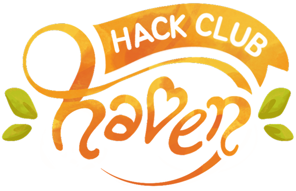
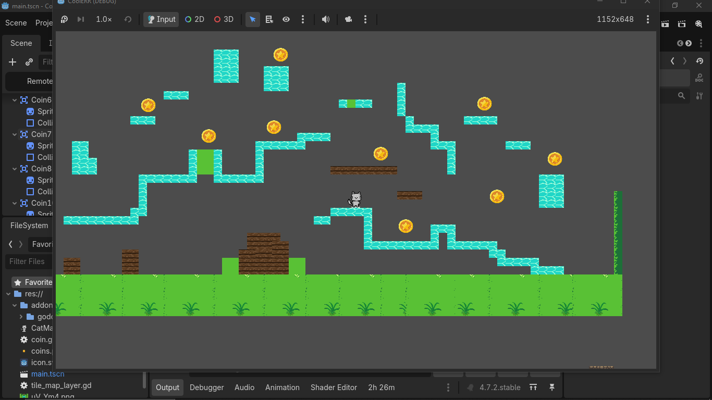
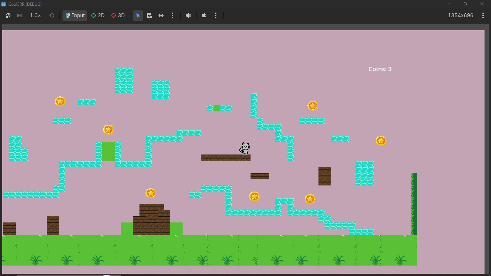

My very first game made in GODOT
It is made as a part of Hack Club Haven, a game-jam style hackathon organized by Hack Club, happening simultaneously in over 200+ cities worldwide on November 14-15.

*ABOUT THE GAME*

**CoolERR** is a 2D platformer built from scratch. You play as a cat exploring tiled stages, jumping between platforms, and collecting hovering coins to rack up your score.
I built this with zero prior Godot experience—learning GDScript, node trees, 2D physics, and tilemaps on the fly over the jam weekend, thanks to the awesome guides provided by #jumpstart-haven ^^

## 🎮 How to Play
| **Move Left / Right** | `A` / `D` or `Left Arrow` / `Right Arrow` |
| **Jump** | `Spacebar` |
| **Objective** | Explore the level and collect as many coins as you can! |
(this does not have levels, as I just begun UwU, will make more cool games!!)

## Some Feature Added
- **Character Physics & Movement**: 2D platforming movement handling running, jumping, velocity, and floor collision detection.
- **Rolling Coin Collectibles**: Sine-wave bobbing animations for coins and collision triggers that increment your coin counter.
- **Audio Feedback**: cute bg music and coin-collecting sound!
- **TileMaps**: took me a while to understand how this shi works, but this is cool

## Built With
- **Engine**: [Godot Engine 4.x](https://godotengine.org/)
- **Language**: GDScript
- **Assets**: 2D pixel art sprites, TileSet layers
- **Audio**: Free sounds from google
- **Published**: on itch.io (play the [game]([url](https://duhh-h.itch.io/coolerr))

Made with Love 🫶🏻 by Poorvi
